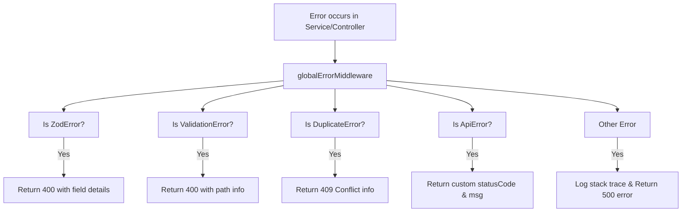

# API Design & Response Guidelines

This document outlines the API guidelines, request/response formats, validation schemas, error handling conventions, and versioning standards.

---

## 1. Request and Response Formats

All API endpoints must conform to a standardized JSON communication contract.

### Successful Response Format
All successful responses must utilize the `sendResponse` helper from [system.utils.ts](file:///c:/bdcalling/explore/monorepo-backend/server/src/app/utils/system.utils.ts):

```typescript
type TResponse<T> = {
  statusCode: number;
  success: boolean;
  message?: string;
  meta?: {
    page: number;
    limit: number;
    total: number;
    totalPage: number;
  };
  data: T;
}
```

**JSON Example:**
```json
{
  "success": true,
  "statusCode": 200,
  "message": "User profiles retrieved successfully.",
  "meta": {
    "page": 1,
    "limit": 10,
    "total": 45,
    "totalPage": 5
  },
  "data": [
    {
      "id": "60d0fe4f5311236168a109ca",
      "email": "user@example.com",
      "role": "user"
    }
  ]
}
```

---

## 2. API Versioning

API endpoints are strictly versioned.
- Routes are registered in [server/src/app/routes/v1/index.ts](file:///c:/bdcalling/explore/monorepo-backend/server/src/app/routes/v1/index.ts).
- Client endpoints are prefixed with `/api/v1` (e.g., `/api/v1/auth/login-with-email`).
- Any breaking changes to models or flows that require backward compatibility must introduce a `/v2/` prefix.

---

## 3. Error Handling Flow (`ApiError` & Global Middleware)

Error handling is automated via Express middleware to guarantee that internal code leaks do not expose details to clients.



### Global Error Payload Format
When an error is thrown, the API returns a structured error object containing:
- `success`: Always `false`.
- `statusCode`: HTTP Status Code.
- `message`: User-friendly simplified error message.
- `error`: Array containing structural elements describing the error location (`path` and `message`).
- `traceId`: String identifying the request execution path in backend logs.
- `stack`: Included only when `NODE_ENV=development`.

**Example Error Output:**
```json
{
  "success": false,
  "statusCode": 400,
  "message": "Invalid password length",
  "error": [
    {
      "path": "body.password",
      "message": "Password must be at least 6 characters long"
    }
  ],
  "traceId": "9b1deb4d-3b7d-4bad-9bdd-2b0d7b3dcb6d"
}
```

### Throwing Errors
When throwing manual errors within Services or Controllers, developers **must** use the `ApiError` class:

```typescript
import { HttpStatusCode } from 'axios';
import ApiError from '@/app/errors/ApiError';
import { getTraceId } from '@/app/configs/requestContext.configs';

// In service logic
throw new ApiError(
  HttpStatusCode.BadRequest, 
  'Resource modification rejected.',
  getTraceId()
);
```

---

## 4. Input Validation (Zod Validation)

Validation must happen at the router entry boundary.

- **Middleware**: [validateRequest.ts](file:///c:/bdcalling/explore/monorepo-backend/server/src/app/utils/validateRequest.ts) wraps the Zod schema checks.
- **Scope**: The validator extracts and checks `body`, `params`, `query`, and `cookies`.

**Routing integration:**
```typescript
import { Router } from 'express';
import validateRequest from '@/app/utils/validateRequest';
import { UserValidation } from './user.validators';

const router = Router();
router.post(
  '/update-profile',
  validateRequest(UserValidation.updateProfileSchema),
  UserController.updateProfile
);
```
