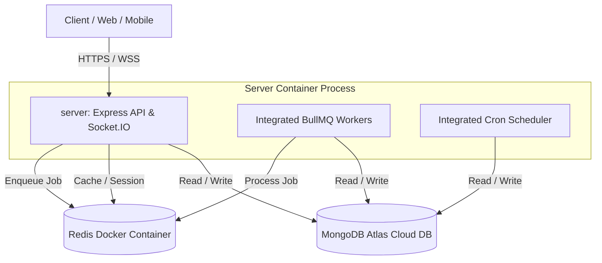
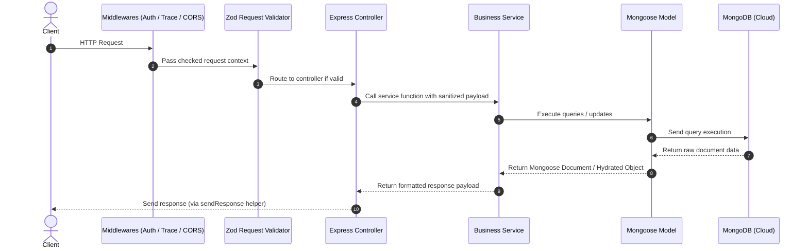

# Single-Repo Backend - System Architecture

This document describes the layered architecture and asynchronous service data flows of the single-repo backend project.

---

## 1. High-Level System Overview

The system consists of the client, a unified Express API server hosting integrated BullMQ Workers and Cron schedules, Redis for queue management, and a cloud-managed MongoDB instance:

---

## 2. Layered Application Architecture (Server)

The Express application in `server/` utilizes a clean, decoupled **Layered Architecture** pattern:

### Key Architectural Layers

#### 1. Routing & Middleware Layer
- **Entrypoints**: Defined inside [server/src/app/routes](file:///c:/bdcalling/explore/singlerepo-backend/server/src/app/routes).
- **Middlewares**: Handles global concerns like request tracing via `trace.middlewares.ts`, CORS validation, multer file uploading, authentication checks using `auth.ts`, and centralized error catching using `globalError.middlewares.ts`.

#### 2. Request Validation Layer
- **Utility**: [validateRequest.ts](file:///c:/bdcalling/explore/singlerepo-backend/server/src/app/utils/validateRequest.ts).
- **Functionality**: Uses Zod validation schemas (defined per module in `<module>.validators.ts`) to validate the request body, parameters, query parameters, and cookies before passing execution to the controller.

#### 3. Controller Layer
- **Responsibility**: Orchestrates the API request and response cycle.
- **Rules**:
  - Should **not** contain business logic.
  - Extracts parameters and payload from the request.
  - Invokes services to perform operations.
  - Calls `sendResponse` helper to standardise Express JSON output.

#### 4. Service Layer
- **Responsibility**: Core business logic and rules.
- **Rules**:
  - Contains calculations, third-party integrations (S3, Stripe, Firebase, Nodemailer), and orchestrates model operations.
  - Interacts with Redis caching helpers.
  - Pushes background jobs into BullMQ queues (like email or notification queues).

#### 5. Data Access / Repository Layer (Mongoose Models)
- **Mongoose Models**: All Mongoose models, constants, and schema definitions are housed in `server/src/app/schemas/`.

---

## 3. Asynchronous Task & Worker Flows

Heavy and long-running operations are deferred to background queue processes to keep HTTP request response times low.

### Queues Configuration
Defined in [queues.ts](file:///c:/bdcalling/explore/singlerepo-backend/server/src/app/queues/queues.ts):
- **Email Queue** (`email-queue`): Handles outbound transactional notifications.
- **Notification Queue** (`notification-queue`): Manages push notifications and real-time alerts.
- **System Queue** (`system-queue`): Processing administrative tasks or data synchronization.

### Event-Driven Flow
1. **Trigger**: User performs an action in the `server` requiring notification dispatch.
2. **Publish**: The `server` service calls `notification-queue` helper to add a job payload.
3. **Queue**: Redis holds the job transaction securely.
4. **Consume**: The integrated background workers process the job from the Redis queue.
