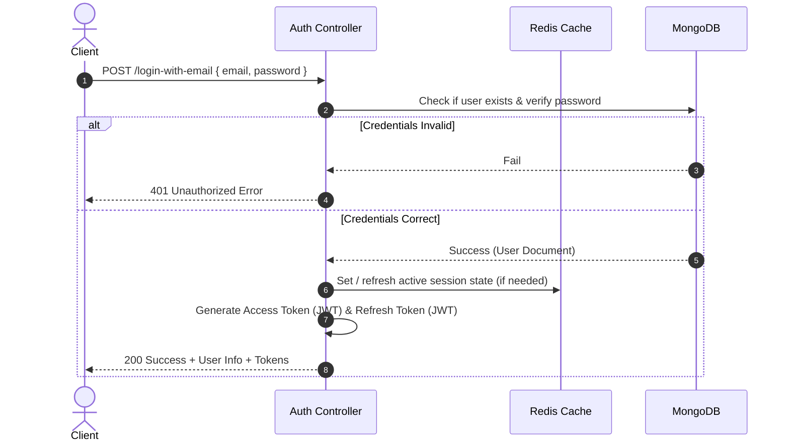
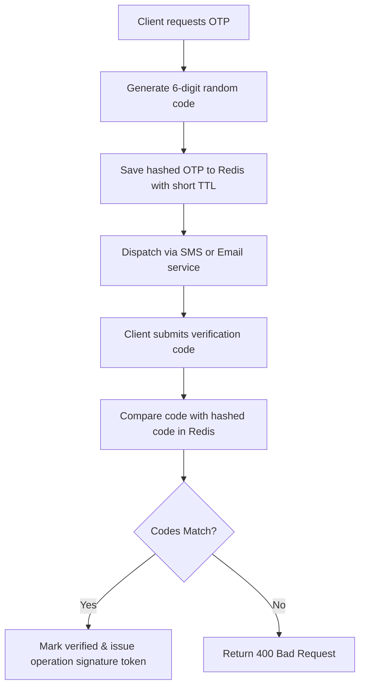

# Authentication & Session Management

This document defines the authentication flow, session patterns, JWT policies, password procedures, and role-based access control (RBAC).

---

## 1. Authentication Flow

The system supports local authentication (Email/Phone + Password), OTP verification, and Social Login (Google and Apple).



---

## 2. JWT Access & Refresh Token Management

Tokens are issued at login/registration and validated per request:
1. **Access Token**:
   - Short-lived JSON Web Token.
   - Sent by the client in the `Authorization` header as a bearer or raw token (validated via [auth.ts](file:///c:/bdcalling/explore/monorepo-backend/server/src/app/middlewares/auth.ts)).
   - Verifies the user's role and email payload using `JWT_ACCESS_TOKEN_SECRET_KEY`.
2. **Refresh Token**:
   - Long-lived JSON Web Token.
   - Sent to the `/refresh-token` endpoint to issue a new Access Token.
   - Verifies ownership and updates credentials using `JWT_REFRESH_TOKEN_SECRET_KEY`.

---

## 3. OTP Flow (One-Time Password)

For phone confirmation, account validation, or password recovery, OTP verification is enforced:



- **Hashing**: OTP keys are validated against a local salt (`OTP_HASH_SECRET`).
- **Storage**: Tracked inside Redis with a strict 3-5 minute TTL to prevent reuse or brute force attacks.

---

## 4. Role-Based Access Control (RBAC)

Authorization is managed declaratively inside routes using the `auth` middleware:

```typescript
import { Router } from 'express';
import auth from '@/app/middlewares/auth';

const router = Router();

// Route restricted to admin users only
router.post(
  '/admin/settings',
  auth('admin'),
  AdminController.updateSettings
);

// Route accessible by multiple roles
router.get(
  '/dashboard',
  auth('admin', 'user', 'manager'),
  DashboardController.getOverview
);
```

### Safety and Block Checks
Inside the `auth` middleware:
- **Existence Check**: Verifies that the user still exists in the database.
- **Deletion Check**: Blocks the request immediately if `user.isDeleted` is set to `true` (returns `404 Not Found`).
- **Block Status**: Checks `user.status === 'blocked'` (returns `403 Forbidden`).
