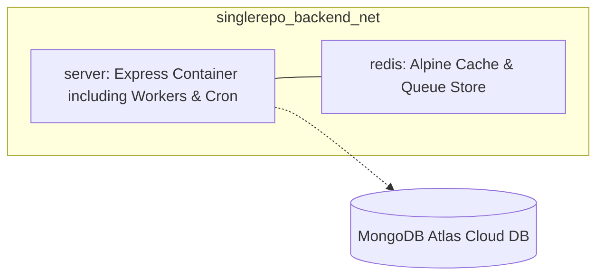

# Deployment & Container Configuration

This document covers Docker container setups, environment dependencies, and deployment procedures for the single-repo backend.

---

## 1. Docker Compose Stack

The stack defines isolated networks and persistent volumes to build and connect the server and redis services securely.

### Network Isolation
All containers communicate through the dedicated bridge network `singlerepo_backend_net`. External port access is limited:
- **Server**: Exposes port `5000` to direct hosts.
- **Redis**: Exposed on port `6379` localhost.

---

## 2. MongoDB Cloud Database Connection

Instead of managing MongoDB locally in docker containers, this project uses a cloud-managed database (e.g. MongoDB Atlas).

- **Connection**: Handled through the `MONGODB_URI` environment variable loaded by the server.
- **Reliability**: Scalability and replicas are completely managed by MongoDB Atlas.

---

## 3. Environment Variables Reference

Environment configurations reside locally in the `server` directory.

| Service | Environment File | Crucial Variables |
| :--- | :--- | :--- |
| **server** | [server/.env](file:///c:/bdcalling/explore/singlerepo-backend/server/.env) | `MONGODB_URI`, `REDIS_HOST`, `REDIS_PASSWORD`, `REDIS_PORT`, `JWT_ACCESS_TOKEN_SECRET_KEY`, `OTP_HASH_SECRET`, `SMTP_USER`, `S3_BUCKET_NAME` |

---

## 4. Volume Persistence

Named volumes are declared at the bottom of the Compose file to retain cache data across container resets:
- `redis_data`: Redis memory snapshots.
