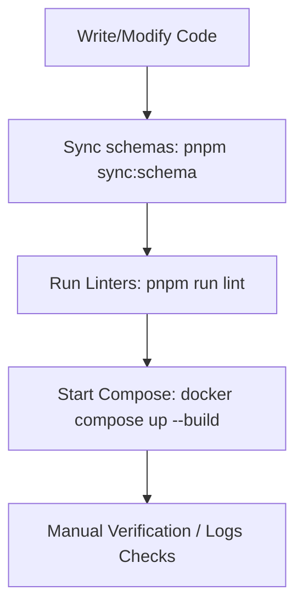

# Development & Verification Workflows

This document outlines the developer workflow, code validation steps, linting, and testing patterns.

---

## 1. Development Lifecycle

The backend codebase uses Docker Compose to manage runtime services (MongoDB, Redis, and App Services).



### Setup Step-by-Step
1. **Bootstrap local settings**:
   ```bash
   cp server/.env.example server/.env
   cp worker/.env.example worker/.env
   cp corn/.env.example corn/.env
   ```
2. **Launch development containers**:
   ```bash
   docker compose up --build
   ```
3. **Execute migrations and seed scripts**:
   - Initialise platform defaults: `docker compose exec server pnpm run seed:settings`
   - Initialise admin user: `docker compose exec server pnpm run create:admin`

---

## 2. Code Verification Checklists

Before raising a Pull Request, verify your changes conform to the standard style guide:

- **Schema Check**:
  - If you created or modified schemas under `schemas/`, ensure you run `pnpm run sync:schema`.
  - Confirm the generated folders (e.g. `server/src/app/schemas/`) are populated correctly.
- **Linting Check**:
  - Run `pnpm run lint` in each service directory (`server/`, `worker/`, `corn/`) to verify static analysis checks pass.
- **Code Formatter Check**:
  - Run `pnpm run format` to enforce formatting guidelines.

---

## 3. Testing Implementation Guidelines

Currently, tests can be configured using Jest and Supertest. When adding unit and integration tests, follow these rules:

1. **Decouple controllers from servers**:
   - Ensure the Express `app` is exported without starting the socket listener directly in the file.
   - Use `supertest` to mount the Express app and simulate requests.
2. **Mock Third-Party Integrations**:
   - Mock all AWS S3 requests, Stripe payment endpoints, and Firebase push notifications to avoid external dependencies.
3. **Database Test isolation**:
   - Use a separate MongoDB database string or a Mongoose mock configuration to keep test suites from altering development database documents.
